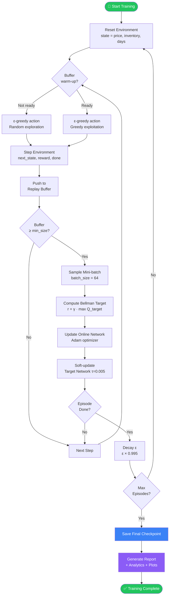

<div align="center">

# 🏨 RL Dynamic Pricing Agent

### Deep Reinforcement Learning for Revenue-Optimised Dynamic Pricing in Travel & Hospitality

[](https://python.org)
[](https://pytorch.org)
[](https://gymnasium.farama.org)
[](LICENSE)
[]()

<br/>

> **An end-to-end Deep Q-Network (DQN) agent that learns to set optimal room prices by maximising long-term revenue, outperforming fixed, random, and rule-based pricing strategies.**

</div>

---

## 📋 Table of Contents

- [Project Overview](#-project-overview)
- [Problem Statement](#-problem-statement)
- [Business Objective](#-business-objective)
- [Features Implemented](#-features-implemented)
- [Project Architecture](#-project-architecture)
- [Reinforcement Learning Workflow](#-reinforcement-learning-workflow)
- [Technologies Used](#-technologies-used)
- [Folder Structure](#-folder-structure)
- [Installation Guide](#-installation-guide)
- [Usage Instructions](#-usage-instructions)
- [DQN Agent Overview](#-dqn-agent-overview)
- [Environment Description](#-environment-description)
- [Baseline Pricing Strategies](#-baseline-pricing-strategies)
- [Evaluation Metrics](#-evaluation-metrics)
- [Outputs Generated](#-outputs-generated)
- [Future Improvements](#-future-improvements)
- [Screenshots](#-screenshots)
- [License](#-license)
- [Author](#-author)

---

## 🔍 Project Overview

The **RL Dynamic Pricing Agent** applies Deep Reinforcement Learning to the revenue management problem faced by hotels, airlines, and other capacity-constrained businesses. The agent observes the current price, remaining inventory, and remaining time, then selects a pricing action to maximise cumulative revenue across a booking horizon.

This project builds a complete, production-structured pipeline — from environment simulation and DQN training, to model checkpointing, visualisation, analytics, and strategy benchmarking.

---

## ❓ Problem Statement

Pricing in the travel and hospitality sector is notoriously difficult:

- **Demand is stochastic** — it fluctuates daily based on season, events, and competitor prices.
- **Inventory is perishable** — unsold rooms generate zero revenue.
- **Traditional rules fail** — fixed or manually tuned prices cannot adapt to real-time demand signals.

Existing revenue management systems rely on rule-based heuristics that require constant manual calibration and cannot generalise to novel demand patterns. This creates a clear need for a data-driven, adaptive pricing strategy.

---

## 🎯 Business Objective

| Objective | Description |
|---|---|
| **Maximise Revenue** | Learn a pricing policy that maximises total revenue across a booking horizon |
| **Outperform Baselines** | Beat fixed, random, and rule-based pricing strategies on every KPI |
| **Generalise** | Adapt to varying demand conditions without human re-tuning |
| **Interpretability** | Provide analytics, comparison reports, and time-series plots for business stakeholders |

---

## ✅ Features Implemented

| # | Feature | Module |
|---|---|---|
| 1 | DQN Agent with dual Q-networks (online + target) | `src/agents/dqn_agent.py` |
| 2 | Experience Replay Buffer | `src/agents/replay_buffer.py` |
| 3 | Full training loop with ε-greedy exploration | `src/training/train.py` |
| 4 | Centralised hyperparameter config dataclass | `src/config/dqn_config.py` |
| 5 | Model checkpointing (save / load / auto-resume) | `src/utils/checkpointing.py` |
| 6 | In-training metric tracking (reward, loss, ε) | `src/evaluation/metrics.py` |
| 7 | Post-training evaluation with greedy rollouts | `src/evaluation/evaluate.py` |
| 8 | Training curve visualisation (4 plots + dashboard) | `src/evaluation/visualization.py` |
| 9 | Training report export (text file) | `src/evaluation/report.py` |
| 10 | Baseline pricing strategies (Fixed, Random, Rule-Based) | `src/baselines/strategies.py` |
| 11 | Strategy comparison harness with KPI table | `src/evaluation/comparison.py` |
| 12 | Environment state visualisation (time-series PNGs) | `src/evaluation/env_visualization.py` |
| 13 | Performance analytics dashboard with CSV/JSON export | `src/evaluation/analytics.py` |

---

## 🏗️ Project Architecture

```
┌─────────────────────────────────────────────────────────────────┐
│                     RL Dynamic Pricing Agent                     │
├─────────────────────────────────────────────────────────────────┤
│                                                                   │
│   ┌──────────────────┐     ┌───────────────────┐                │
│   │  PricingEnv       │────▶│   DQN Agent       │               │
│   │  (Gymnasium)      │◀────│  (Online + Target) │               │
│   └──────────────────┘     └────────┬──────────┘                │
│                                      │                            │
│                              ┌───────▼──────────┐               │
│                              │  ReplayBuffer     │               │
│                              │  (10K capacity)   │               │
│                              └───────┬──────────┘               │
│                                      │                            │
│   ┌──────────────────────────────────▼──────────────────────┐   │
│   │                    Training Loop                          │   │
│   │  ε-greedy → step env → push buffer → sample → learn      │   │
│   │  → soft-update target → decay ε → checkpoint             │   │
│   └──────────────────────────────────┬──────────────────────┘   │
│                                      │                            │
│   ┌──────────────────────────────────▼──────────────────────┐   │
│   │                  Evaluation Pipeline                      │   │
│   │  TrainingMetrics → Report → Visualization → Analytics    │   │
│   │  Comparison (DQN vs Fixed / Random / Rule-Based)         │   │
│   └──────────────────────────────────────────────────────────┘   │
└─────────────────────────────────────────────────────────────────┘
```

---

## 🔄 Reinforcement Learning Workflow



---

## 🛠️ Technologies Used

| Category | Technology | Purpose |
|---|---|---|
| **Language** | Python 3.10+ | Core implementation |
| **Deep Learning** | PyTorch 2.x | Q-Network (MLP), backprop, Adam optimiser |
| **RL Environment** | Gymnasium 0.29+ | OpenAI-compatible env interface |
| **Visualisation** | Matplotlib | Training curves, time-series plots, dashboards |
| **Numerics** | NumPy | State arrays, batch processing, statistics |
| **Data Export** | CSV / JSON (stdlib) | Analytics and comparison result files |
| **Config** | Python dataclasses | Typed, validated hyperparameter management |
| **Versioning** | Git + GitHub | Source control and issue tracking |

---

## 📂 Folder Structure

```
RL-Dynamic-Pricing-Agent/
│
├── 📄 README.md
├── 📄 .gitignore
│
├── 📁 src/
│   ├── 📁 agents/
│   │   ├── dqn_agent.py          # DQN with dual Q-networks, ε-greedy, soft update
│   │   ├── replay_buffer.py      # Fixed-capacity circular buffer, random sampling
│   │   ├── q_learning_agent.py   # Tabular Q-learning baseline
│   │   └── qlearning.py          # Q-learning utilities
│   │
│   ├── 📁 baselines/
│   │   └── strategies.py         # FixedPrice, RandomPrice, RuleBasedPricing
│   │
│   ├── 📁 config/
│   │   └── dqn_config.py         # Centralised hyperparameter dataclass
│   │
│   ├── 📁 demand/
│   │   ├── demand_simulator.py   # Stochastic demand model
│   │   └── config/
│   │       └── config.py         # MIN_PRICE, MAX_PRICE, INITIAL_INVENTORY
│   │
│   ├── 📁 environment/
│   │   └── pricing_env.py        # Gymnasium PricingEnvironment
│   │
│   ├── 📁 evaluation/
│   │   ├── analytics.py          # KPI computation, console dashboard, CSV/JSON export
│   │   ├── comparison.py         # Strategy benchmarking harness
│   │   ├── env_visualization.py  # Price/Demand/Occupancy/Revenue time-series plots
│   │   ├── evaluate.py           # Post-training greedy evaluation pipeline
│   │   ├── metrics.py            # In-training metric tracker (TrainingMetrics)
│   │   ├── report.py             # Text report generator
│   │   └── visualization.py      # Training curve plots (reward, loss, ε, dashboard)
│   │
│   ├── 📁 training/
│   │   └── train.py              # Main DQN training loop
│   │
│   └── 📁 utils/
│       └── checkpointing.py      # Save / load / auto-resume checkpoints
│
├── 📁 data/                      # Raw and processed datasets
├── 📁 notebooks/                 # Exploratory notebooks
│
└── 📁 outputs/                   # Auto-created at runtime
    ├── plots/                    # Training curve PNGs
    ├── visualizations/           # Environment state time-series PNGs
    ├── analytics/                # CSV + JSON analytics exports
    └── reports/                  # Text training reports
```

---

## ⚙️ Installation Guide

### Prerequisites

- Python **3.10** or higher
- `pip` package manager
- Git

### Step 1 — Clone the Repository

```bash
git clone https://github.com/Radhe0607/RL-Dynamic-Pricing-Agent.git
cd RL-Dynamic-Pricing-Agent
```

### Step 2 — Create a Virtual Environment (Recommended)

```bash
# Windows
python -m venv venv
venv\Scripts\activate

# macOS / Linux
python3 -m venv venv
source venv/bin/activate
```

### Step 3 — Install Dependencies

```bash
pip install -r requirements.txt
```

> **Core dependencies:** `torch`, `gymnasium`, `matplotlib`, `numpy`

---

## 🚀 Usage Instructions

### 1. Train the DQN Agent

```bash
python -m src.training.train
```

The training loop will:
- Print a progress line every 10 episodes
- Save checkpoints to `checkpoints/` every 100 episodes
- Generate a training report in `outputs/reports/` on completion

### 2. Evaluate a Trained Agent

```bash
python -m src.evaluation.evaluate checkpoints/dqn_final.pt
```

Or with all optional outputs enabled:

```python
from src.evaluation.evaluate import run_evaluation

run_evaluation(
    checkpoint_path="checkpoints/dqn_final.pt",
    n_episodes=20,
    save_plots=True,           # outputs/plots/
    save_env_plots=True,       # outputs/visualizations/
    save_analytics=True,       # outputs/analytics/
)
```

### 3. Compare DQN Against Baselines

```bash
python -m src.evaluation.comparison checkpoints/dqn_final.pt 20
```

### 4. Generate Environment Visualisations Only

```bash
python -m src.evaluation.env_visualization checkpoints/dqn_final.pt
```

### 5. Run Performance Analytics Dashboard

```bash
python -m src.evaluation.analytics checkpoints/dqn_final.pt 20
```

### 6. Resume Training from a Checkpoint

```python
from src.training.train import train
from src.config.dqn_config import DQNConfig

train(DQNConfig(max_episodes=2000), resume_from="auto")
```

---

## 🧠 DQN Agent Overview

The agent implements **Deep Q-Network (DQN)** with the following stabilisation techniques from the original DeepMind paper (Mnih et al., Nature 2015):

### Q-Network Architecture

```
Input (state_size=3)
        │
   ┌────▼─────┐
   │ Linear   │  3  → 64
   │   ReLU   │
   └────┬─────┘
        │
   ┌────▼─────┐
   │ Linear   │  64 → 64
   │   ReLU   │
   └────┬─────┘
        │
   ┌────▼─────┐
   │ Linear   │  64 → 5  (one Q-value per action)
   └──────────┘
```

### Key DQN Components

| Component | Implementation Detail |
|---|---|
| **Dual Networks** | Online network trained each step; target network updated via Polyak averaging |
| **Soft Update** | `θ_target ← τ·θ_online + (1−τ)·θ_target` with τ = 0.005 |
| **Experience Replay** | Circular deque of 10,000 transitions; mini-batches of 64 |
| **Bellman Target** | `y = r + γ · max_a Q_target(s', a)` with γ = 0.99 |
| **Loss Function** | Smooth L1 (Huber loss) — robust to outlier rewards |
| **Optimiser** | Adam with lr = 0.001 |
| **Exploration** | ε-greedy: ε decays from 1.0 → 0.05 at rate 0.995 per episode |

---

## 🌍 Environment Description

`PricingEnvironment` is a **Gymnasium-compatible** environment that simulates a hotel room booking scenario over a fixed horizon.

### State Space

The observation is a 3-dimensional continuous vector:

| Index | Feature | Description | Range |
|---|---|---|---|
| 0 | **Current Price** | The price currently being offered | [10, 100] |
| 1 | **Remaining Inventory** | Unsold rooms available | [0, 100] |
| 2 | **Remaining Days** | Days left in the booking horizon | [0, 100] |

### Action Space

5 discrete price levels evenly spaced between `MIN_PRICE` and `MAX_PRICE`:

| Action | Price Level |
|---|---|
| 0 | £10 (Minimum / deep discount) |
| 1 | £32.50 |
| 2 | £55 (Mid-range) |
| 3 | £77.50 |
| 4 | £100 (Maximum / premium) |

### Reward Function

The reward at each time step is the **revenue earned**:

```
demand   = base_demand(100) − price + noise(−10, +10)
bookings = max(0, demand)
reward   = bookings × price
```

This directly aligns the agent's incentive with the business objective of maximising revenue per booking horizon.

---

## 📊 Baseline Pricing Strategies

Three hand-crafted baselines are used to benchmark the DQN agent:

| Strategy | Description | Use Case |
|---|---|---|
| **FixedPriceStrategy** | Always selects one price level (low / mid / high) regardless of state | "Do nothing" / status-quo benchmark |
| **RandomPriceStrategy** | Picks a uniformly random action each step | Lower-bound benchmark — any learning should beat this |
| **RuleBasedPricingStrategy** | Computes urgency = inventory ÷ remaining\_days; discounts when urgency is high, charges premium when low | Traditional revenue management proxy |

### Rule-Based Logic

```
urgency = remaining_inventory / max(remaining_days, 1)

if urgency > 3.0:  → action 0  (lowest price — clear inventory fast)
elif urgency < 1.0: → action 4  (highest price — scarce stock, charge premium)
else:               → action 2  (neutral mid price)
```

All strategies share a common `BaseStrategy` interface (`select_action(state) → int`) so they can be swapped into the comparison harness without code changes.

---

## 📈 Evaluation Metrics

### Training Metrics (`metrics.py`)

| Metric | Description |
|---|---|
| Episode Reward | Total undiscounted reward per episode |
| Moving Average (window=50) | Smoothed reward trend |
| TD Loss | Mean Bellman error per episode |
| Epsilon (ε) | Exploration rate decay curve |
| Buffer Size | Replay buffer fill level |

### Evaluation KPIs (`analytics.py`)

| KPI | Description |
|---|---|
| `avg_reward` | Mean episode reward over evaluation runs |
| `total_revenue` | Sum of all price × demand revenue |
| `avg_occupancy_pct` | Mean final occupancy rate as a percentage |
| `booking_rate` | Fraction of steps where demand > 0 |
| `avg_selling_price` | Mean price charged across all steps |
| `demand_mean / std / min / max` | Full demand distribution statistics |

### Comparison KPIs (`comparison.py`)

| KPI | Description |
|---|---|
| Total Revenue | Σ (price × units sold) across all episodes |
| Total Bookings | Total units sold |
| Occupancy Rate | Bookings ÷ (episodes × max\_steps) |
| Avg Selling Price | Weighted mean price |
| Avg Reward | Mean episode reward |

---

## 📦 Outputs Generated

Every run of the pipeline auto-creates the following files:

```
outputs/
├── plots/
│   ├── episode_rewards.png        # Raw + moving-average reward
│   ├── moving_average_reward.png  # Smoothed reward trend
│   ├── training_loss.png          # TD error over training
│   ├── epsilon_decay.png          # ε decay curve
│   └── training_dashboard.png     # 2×2 combined dashboard
│
├── visualizations/
│   ├── price_vs_time.png          # Price at each step
│   ├── demand_vs_time.png         # Demand at each step
│   ├── occupancy_vs_time.png      # Cumulative occupancy %
│   ├── revenue_vs_time.png        # Cumulative revenue
│   └── env_dashboard.png          # 2×2 environment state dashboard
│
├── analytics/
│   ├── dqn_agent_analytics_<timestamp>.csv
│   └── dqn_agent_analytics_<timestamp>.json
│
├── comparison_results.csv         # Strategy benchmarking table
├── comparison_results.json        # Strategy benchmarking (with metadata)
│
└── reports/
    └── dqn_report_<timestamp>.txt # Complete training summary report
```

```
checkpoints/
├── dqn_ep100.pt
├── dqn_ep200.pt
├── ...
└── dqn_final.pt
```

---

## 🔮 Future Improvements

| Priority | Improvement | Description |
|---|---|---|
| 🔴 High | **Full Environment Implementation** | Replace the stub `PricingEnvironment` with real inventory tracking, seasonal demand, and competitor pricing |
| 🔴 High | **Real Dataset Integration** | Train on historical hotel booking data (OTA datasets, STR reports) |
| 🟡 Medium | **Double DQN** | Use online network to select actions, target network to evaluate — reduces overestimation bias |
| 🟡 Medium | **Dueling DQN** | Separate Value and Advantage streams in the Q-network |
| 🟡 Medium | **Prioritised Experience Replay** | Sample transitions proportional to TD error |
| 🟡 Medium | **Continuous Action Space** | Switch to DDPG / SAC to allow any price, not just discrete levels |
| 🟢 Low | **Hyperparameter Tuning** | Optuna-based automated search over learning rate, gamma, epsilon schedule |
| 🟢 Low | **Multi-Agent Extension** | Model competing hotels as cooperative or adversarial agents |
| 🟢 Low | **Web Dashboard** | Streamlit UI for real-time training monitoring and strategy comparison |

---

## 🖼️ Screenshots

> _Training plots are generated automatically in `outputs/` after each run._

| Plot | Description |
|---|---|
| `training_dashboard.png` | 2×2 grid: episode rewards, smoothed reward, TD loss, ε decay |
| `env_dashboard.png` | 2×2 grid: price vs time, demand vs time, occupancy vs time, revenue vs time |
| `eval_rewards.png` | Bar chart of greedy evaluation episode rewards with ±1 std band |

---

## 📝 License

This project is licensed under the **MIT License**.

```
MIT License

Copyright (c) 2025 Radhe

Permission is hereby granted, free of charge, to any person obtaining a copy
of this software and associated documentation files (the "Software"), to deal
in the Software without restriction, including without limitation the rights
to use, copy, modify, merge, publish, distribute, sublicense, and/or sell
copies of the Software, and to permit persons to whom the Software is
furnished to do so, subject to the following conditions:

The above copyright notice and this permission notice shall be included in all
copies or substantial portions of the Software.

THE SOFTWARE IS PROVIDED "AS IS", WITHOUT WARRANTY OF ANY KIND, EXPRESS OR
IMPLIED, INCLUDING BUT NOT LIMITED TO THE WARRANTIES OF MERCHANTABILITY,
FITNESS FOR A PARTICULAR PURPOSE AND NONINFRINGEMENT.
```

---

## 👤 Author

<div align="center">

**Radhe**

[](https://github.com/Radhe0607)

*Building intelligent pricing systems with Deep Reinforcement Learning*

---

⭐ **If this project helped you, please consider giving it a star!** ⭐

</div>
